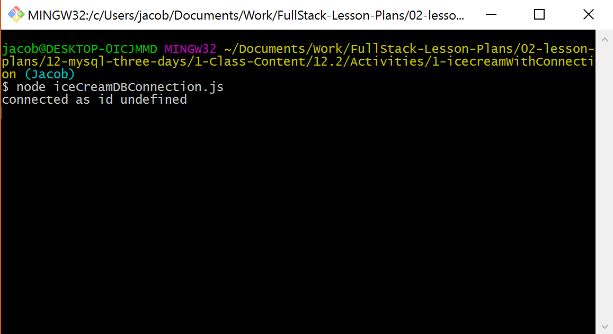
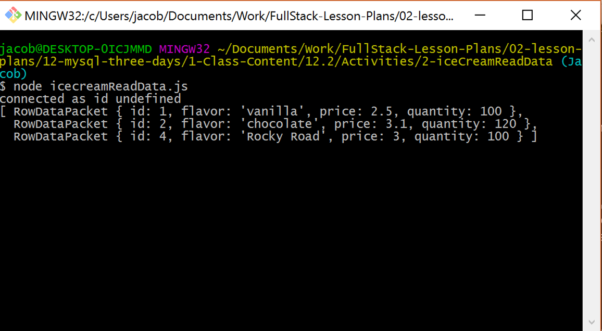
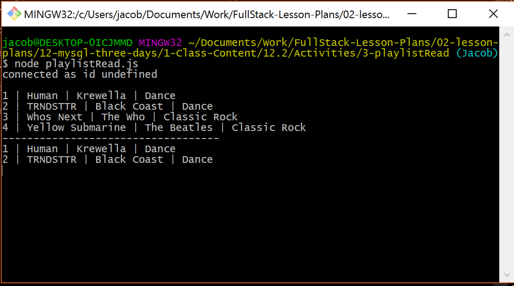

## 12.2 Lesson Plan - Node Gets a SQL

### Overview
While the first class of the week took us away from JavaScript and Node for a tiny bit, today's class combines the old with the new in a way that shows just how powerful a MySQL server can be. With that being said, be on the lookout for small errors in syntax over the course of today's lesson. MySQL is VERY particular about the syntax that is used and this can lead to stress.

##### Instructor Priorities:
* Walk students through how to create a connection to MySQL databases using Node
* Students should be able to select data from a MySQL database using Node and use that data in simple JavaScript applications
* Students should be able to add, change, and remove data from MySQL databases using Node and simple JavaScript applications
* Groups should have a decent understanding of how to take a core concept for a small application and create a prototype based upon it

##### Instructor's Notes:
* MySQL in Node is VERY particular about the syntax that it uses and will return an error if it finds something isn't right. Tell your students to be on the lookout for small issues with their syntax before thinking there is anything else wrong with their code.

* Those students who struggled with either MySQL or Node might find today's class difficult as well since it is built upon both of those concepts. If you can, try to help them catch up during the longer assignments if it looks as if they are having trouble.

-------

# Class Objectives

* To create a connection to a MySQL database using Node
* To create, read, update, and delete data from a MySQL database using Node
* To work with a group in taking a basic concept for a server side application and creating a working prototype for that application within a given timeframe

---------

### 1. Instructor Do: Welcome Class (2 mis)
* Welcome your students to day 2 of MySQL!

* Tell them that today we will be returning to JavaScript with our newly acquired SQL skills and combining them to create back-end applications that utilize MySQL data. In this way, they will essentially be learning how to manipulate back-end data through applications.

### 2. Instructor Do: Creating a Database Connection Demo (5 mins)
* First thing is first, we cannot manipulate the data within a MySQL database without first creating a connection to that specific database. This is actually a lot easier than it sounds thanks to the "MySQL" NPM package for Node.

* Open up git bash within the folder containing [iceCreamDBConnection.js](Activities/1-iceCreamWithConnection/iceCreamDBConnection.js) but do not yet open up the file containing your code.

* Within Git Bash, type `npm install mysql` and then hit enter to download the package.

* With the MySQL NPM now installed, open up a new sublime folder and type in the following code while explaining what the code does.

```js
var mysql = require('mysql');
var connection = mysql.createConnection({
  host: 'localhost',
  port: 3306,
  user: '', // <---- Your username
  password: '', // <---- Your password
  database: 'icecreamDB'
});
```

* The first line tells the application that the "mysql" NPM must be installed in order to run. while the following connection line creates a connection to the "icecreamDB" database using a localhost connection.

* After explaining all of this, add in the following lines of code to have Node connect to the MySQL server and inform the user that they have connected properly.

```js
connection.connect(function(err){
  if(err) throw err;
  console.log('connected as id '+ connection.threadId);
});	
```

* Run the code in Git Bash and show the result to the class, asking for any questions regarding this process before slacking out the following assignment.

  * 

### 3. Students Do: Creating a Database Connection (10 mins)

* More time than necessary has been provided to this particular assignment to ensure that everyone creates a connection to MySQL through Node and is given ample time to create and populate a table.

* While they are working on this assignment, create a table called "products" within your database and popluate it with the data located within [icecreamSeeds.sql](Activities/2-iceCreamReadData/iceCreamSeeds.sql)

* **Instructions**

  * Throughout this class we are going to be working on creating an application that takes in music data to create personalized playlists

    * Make sure to get as far as you can over the course of these assignments as the coding you do here will be extremely useful to you when you begin working on the homework

  * For now we will simply be creating your database in MySQL and then creating a connection to said database using Node. **Remember, you must create a database before attempting to connect to it. Doing otherwise will return an error.**

  * BONUS: Using MySQL Workbench, create a table in your databse with four columns...
    * Primary Key of "ID" which auto-increments
    * A column called "title"
    * A column called "artist"
    * A column called "genre"

  * BONUS: Using MySQL Workbench, populate your table with a few rows of dummy data

  * BONUS: Start looking into how you can use the MySQL NPM package to read data from a MySQL database

### 4. Instructor Do: Reading Data From a Database (10 mins)

* After everyone has finished the previous assignment, open up [iceCreamDBConnection.js](Activities/1-iceCreamWithConnection/iceCreamDBConnection.js) once more

* While we have created a connection to our MySQL databases, we have not yet grabbed any data from it. As you might imagine, this is kind of an improtant feature to be missing and so we are going to solve that now

* Turns out that calling records from a MySQL database using Node is a whole lot easier than one might initially imagine so long as you understand SQL syntax. This is because the MySQL NPM package uses pretty much the same exact syntax in its usage

* To emphasize this, add the following code to the end of [iceCreamDBConnection.js](Activities/1-iceCreamWithConnection/iceCreamDBConnection.js) so that it matches the code found within [icecreamReadData.js](Activities/2-iceCreamReadData/icecreamReadData.js) and then discuss it with the class before running it in Git Bash

```js
connection.query('SELECT * FROM products', function(err, res){
  if(err) throw err;
  console.log(res);
});
```

* Through calling `connection.query(<STRING>,function(err,res){})`, we are telling Node to send an SQL query to our database and return the data collected through the "res" variable

* The <STRING> portion uses SQL syntax and should be contained within a pair of quotes. Because of this, you should tell your students to be very careful with their syntax since even small differences could lead to an error being returned.

  * The query contained within the <STRING> can be switched out with any other kind of SQL query which will allow you to collect specific types of data as well.

* Run the code in Git Bash and the data contained within your database should be returned to you as an array of objects.

  * 
  
  * Be sure to make note of the `RowDataPacket` that comes before each object. Students may think that this would impact the ways in which you would call specific data (eg. `res[0].RowDataPacket.id`), but this is not actually necessary. The data can be called as per normal.

* Also make sure to note how the data stored within this query is limited in its scope. Calling "res" outside of the query would not return anything unless the data was stored within a global variable.

### 5. Students Do: Collecting Data From a Database (15 mins)

* Once again, more than enough time has been given for this assignment so as to provide students with the opportunity to tackle the bonuses since both of these would assist them greatly in tackling this week's homework.

* While this assignment is going on, take a few moments to take the code contained within [playlistSeeds.sql](Activities/3-playlistRead/playlistSeeds.sql) and running it in MySQL Workbench so that you can go over the assignment with the class afterwards

* Check to see if there are any questions from the previous part of the lesson before slacking out the following instructions to the class...

* **Instructions**

  * Using the connection and song data you put together earlier into the class, we are going to print playlists to the Git Bash console based upon the genre or artist.

  * First create code that prints all songs within your database to Git Bash.

  * Now create code that prints songs of a specific genre/artist to the Git Bash console.

    * If you don't have many songs in your database at this point in time, take this moment to add some more to it. Try to give yourself a variety of songs to work with.

    * HINT: Remember that you can call specific data using SQL commands we went over last class. If you are having trouble, make sure to look into SQL commands once more.

  * BONUS: See if you can create more stylized tables within the Git Bash console

    * This will require utilizing some JavaScript to pull off smoothly, but will be a huge boon to your tackling the homework if you can figure out how to accomplish this task now.

  *BONUS: See if you can make a MySQL query which, instead of taking in a complete string, can contain variables which switch up the search parameters.

    * There are a couple different ways to accomplish this task, but the most common one can be found within the documentation for the MySQL NPM package.

### 6. Everyone Do: Collecting Data From a Database (10 mins)

* Open up the file titled [playlistRead.js](Activities/3-playlistRead/playlistRead.js) in sublime to go over some of the finer points of the past assignment.

  * 

* While the first query is much like that which we went over earlier, the second one is the one that is most interesting because it contains a query that seems incomplete as there is a question mark at the end of it. What this syntax allows the user to do, however, is place an array after the query string whose contents will replace the question marks with those variables contained within the array.

  * Why is this useful? It allows for programmers to plug in multiple variables using the same bit of code. We will go over this kind of thing more in future classes, but anything that makes a piece of code more reusable is a bonus in the wild world of programming.

* As many within the class may have realized when attempting the first bonus, printing a table to the console in a format that is visually akin to an excel spreadsheet or an HTML table is not a simple task. Fortunately this is not a huge deal in programming as we will primarily be sending data collected from a database to the front end to be displayed in an HTML format. That means that very few people are going to be using a console to view your databases, so creating a table there is not necessary most of the time... Thank goodness.

  * If you really want to create a pretty table within the console, my best advice would be to be to try and create concrete spacing.

  * I guess what we are trying to say here is that you should not stress out about making a pretty table in the console when you get to the homework. Focus on making a working app first and then worry about prettying it up afterwards. When working with the console, start with substance before working on the looks.

### 7. Instructor Do: Creating, Updating, and Deleting Data Using Node (15 mins)

* When creating programs that deal with databases, there is a rather fun acronym which a lot of programmers use in order to remind themselves which functions they have available to them. This acronym is C.R.U.D

```
C - CREATE - INSERT INTO pets (name, type, age) VALUES ('fido', 'dog', 3);
R - READ   - SELECT * FROM pets;
U - UDPATE - UPDATE pets SET name='under dog' WHERE type = 'dog';
D - DELETE - DELETE FROM pets WHERE type = 'mouse';
```

* So far we have only really gone over one of the four letters of C.R.U.D today, but now that we have a firm understanding on the basics we can more easily jump into the others without spending as much time on them independently. This is because they all use nearly identical calls to that of your typical READ query with many of the changes only being the SQL query being made.

* Go over each of the following examples one at a time, adding them into your icecream application from earlier in the class and running them in Git Bash.

```js
connection.query("INSERT INTO products SET ?", {flavor:"Rocky Road", price:3.00, quantity:50}, function(err, res){});
```

* Point out to students how similar this looks to the code which reads data with the only major differences coming in the query made and the data being entered.
  
  * When inserting data into a MySQL database using Node, the format is to use object notation with the keys being the columns that you would like to insert data into.

  * Make sure that the data you are entering into your columns matches the types the server is expecting. Doing otherwise might cause the server to crash since it will not know how to handle the data you are passing it.

```js
connection.query("UPDATE products SET ? WHERE ?", [{quantity: 100}, {flavor: "Rocky Road"}], function(err, res){});
```

* Updating data is VERY similar to creating data, the only significant difference being the addition of the WHERE statement which allows you to interact with specific rows of data

  * Your students will also notice that we are using two question marks within this statement, one for the SET and one for the WHERE. What's cool about this is that, by using an array, we are able to replace both question marks with the elements contained within said array.

  * First question mark is replaced with the first object in the arry while the second question mark is replaced with the second object in the array.

```js
connection.query("DELETE FROM products WHERE ?", {flavor: "strawberry"}, function(err, res){});
```

* Deleting MySQL data through Node is almost entirely identical to a READ query that includes a WHERE statement within it. Not much else to it other than that.

* Ask your class if they have any questions and answer them as best you can before moving onto the next activity.

### 8. Students Do: CRUD Playlist (20 mins)

* Slack out the following instructions.

* **Instructions**

  * It's time to start making our playlist application a little more functional through including all four C.R.U.D elements within it.

  * Add in some pieces of code that CREATE, UPDATE, and DELETE specific pieces of data from your MySQL database. Make sure to include a READ statement at the end as well to ensure that the changes you are making are working properly.

  * BONUS: After successfully adding C.R.U.D to your application, it's time to test your mettle and see if you can make it so this app is more dynamic through allowing users to dynamically input their own data into the database using either the Prompt or Promptly NPM packages.

    * HINT: Recall that you can create MySQL queries which include variables through including question marks. Proper usage of this will help you quite a bit.

    * HINT: Remember to take into account the scope of Prompt/Promptly when putting your application together.

-------

### 9. BREAK (15 mins)

-------

### 10. Groups Do: Great-Bay (60 mins)

* When everyone is back from break, split them up into groups of three or four and then slack out the following instructions...

* **Instructions**

  * Within your groups you are going to be creating a Node application called "Great-Bay" which allows users to create and bid on assorted items, tasks, jobs, or projects.

  * The basic application is fairly simple: Upon loading up the program, the user is prompted on whether they would like to "POST AN ITEM" or "BID ON AN ITEM"

    * If the user selects to "POST AN ITEM" they are prompted for an assortment of information regarding the item and then that information is added to the database so that others can bid on it

    * If the user selects to "BID ON AN ITEM" they are shown a list of all available items and then are prompted to select what they would like to bid on. The console then asks them for how much they would like to bid. If the bid is higher, it replaces the previous amount. If the bid is lower, then it returns that the bid was too low and boots them back to the selection screen. If the bid is higher, it replaces the previous bid with the new one.

  * Once your group has put together the basic application, it's time to test your collective skills on some of these addons. Remember to take into consideration the amount of time you have been given when choosing which addons you would like to try and tackle.
    
    * Create a sign-up and login system for users that prompts them for a username and password upon loading up the app. **Do not worry about setting up a truly secure database if you choose to tackle this addon. Just work on getting it to have working sign-up and login features.**

    * Create a system on the "POST AN ITEM" which allows users to look at the auctions they have created. On this screen they can add new auctions, modify previous auctions, or close bidding on an auction.

    * Create a system which allows users to view all of the auctions that they are the leading bidder of.

    * Create a third option on the main screen which allows for administrators to modify the database as they see fit.

    * Create visually appealing tables. This means making dynamic console code and it is a lot harder than it might seem at first so do not think this one is so simple.

    * Create a search function that allows users to look through the database of available auctions to find those that share the specified keyword or username.

    * Get creative! There are a lot of addons to this app which you could create so feel free to work with your group to come up with something we haven't yet!

### 11. Everyone Do: Share Your Work (20 mins)

* With any luck, the class has been able to tackle not only the basic assignment, but has also managed to put together a few different addons for the application which they can share with everyone else.

* Start out this part of the class by asking a group who feels confident in their code for the basic application and is confident that it works to slack it out and then walk the rest of the class through it. Make yourself available to answer questions the rest of the class might have regarding the group's code if there are any individuals who seem very confused.

* Next, start running through the list of addons we suggested above and see if there are any groups out there who are willing to share their solutions with the class.

* Finally, ask the class if there were any groups who went above and beyond to create their own addons for the application and have them share this code with the class as well. 

# Copyright
Coding Boot Camp (C) 2016. All Rights Reserved.
