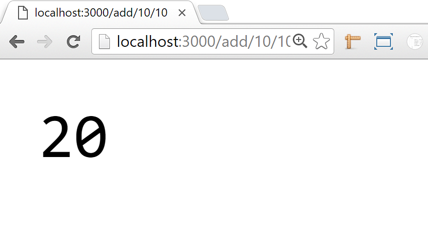
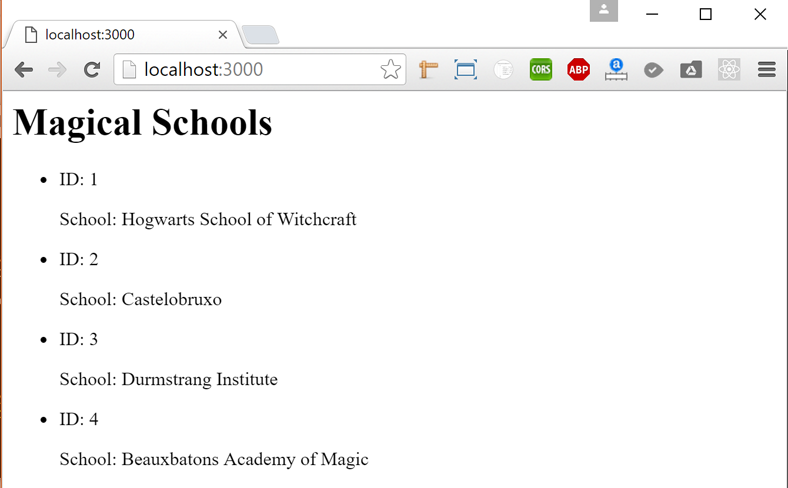
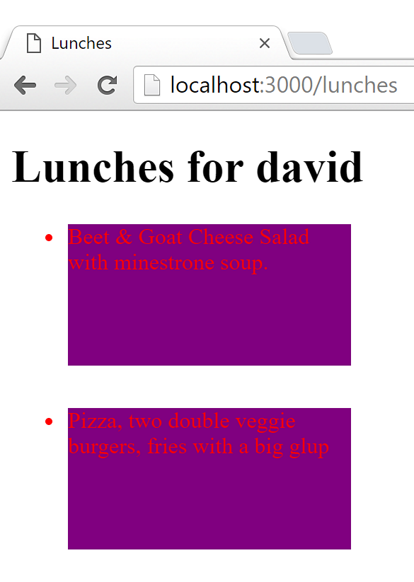

## 14.1 Lesson Plan: - I Can Make an App With Some Handlebars...

### Overview
Students will be diving into the basics of Handlebars today, a semantic templating language which can be used to link back-end javascript data to front-end HTML with relative ease.

##### Instructor Priorities:

* Students should know how to pass MySQL data to the front-end with Express
* Students should have a moderate understanding of the basic Handlebars syntax
* Students should be able to pass server-side data to the page using Express and Handlebars

##### Instructor Notes:

* Before jumping into Handlebars, we will be going over how to send MySQL data from the back-end to the front-end. Depending upon how well this goes, you may or may not wish to review Express some more today and tackle Handlebars later into the week.
* Handlebars can seem daunting at first, but it is ultimately a very powerful templating tool which your students might find useful. Try to keep to a pace that your students seem comfortable learning at so as to make sure no one is left behind. 

-------

### Class Objectives

* To send MySQL data from the back-end to the front-end using Express
* To introduce students to semantic templating using Handlebars
* To understand the basic syntax for Handlebars to create simple web applications
* To create an Express connection to a front-end application which takes in MySQL data and prints it to the screen using Handlebars

-------

### 0. Instructor Do: Welcome Students and Introduce HW (1 min)

* Welcome students to week 14 of their coding bootcamp! They have come a long ways since they first began and are already at a point where, if they are comfortable in their abilities, they could theoretically start applying for jobs! 

* There is stil much left to learn, however, and today we are going to be delving into the wonderful world of templating languages!

### 1. Instructor do: Show This Week's Homework (5 mins)

* Before slacking out the warm-up assignment for your students, open up your terminal so that you are inside of the [BurgerSolution](../../2-Homework/BurgerSolution) folder, run `npm install`, run `node server.js`, and then open up the application within your browser.

* Show off all the functions for the application, doing your best to explain them.

* Tell your students that this will be the assignment due by the end of the week and that it uses Node, Express, MySQL, and the templating language Handlebars which they will be learning later today.

### 2. Students Do: Express Calculator (20 mins)

* After answering any and all questions your students may have, slack out the following instructions for the warm-up assignment...

* **Instructions**

  * You will create an express calculator application with one get route that is able to take in three parameters: An operation and two numbers.

  * There are four opperation values hich a user may use: Addition, Subtraction, Multiplication, and Division.

  * When the route is hit, your browser should display the result of the math operation and the numbers two numbers on the screen.

    * For Example: When the user goes to the url http://localhost:3000/addition/10/1, the page should display 11.

### 3. Everyone Do: Express Calculator Review (15 mins)

* After your class has completed the calculator excercise, open up [ExpressCalculator.js](Activities/1-ExpressCalculator/ExpressCalculator.js) within Sublime and have your students go through the code line-by-line with you.

  * 

* Make sure that everyone in your class seems comfortable working with Express. If your students seem confused or lost, feel free to review Express with them. While Handlebars is a very useful templating language, understanding Express is very important in web development.

### 3. Instructor Do: Wizarding Schools (15 mins)

* Open up [MagicSchema.sql](Activities/2-MagicalSchools/MagicSchema.sql) and run it within MySQL Workbench

* Open up and run [MagicSchools.js](Activities/2-MagicalSchools/MagicSchools.js) within both Sublime and within your terminal before running the code.

  * Make sure to run `npm install` berfore running `node MagicSchools.js` within your terminal.

  * 

* Explain to your students how the HTML within your code is being generated and sent to the browser.

  * Information is being taken from the MySQL database, looped through, and then given HTML syntax so that they appear with some basic styling upon the page.

### 4. Partners Do: Seinfeld Application (25 mins)

* Once all questions regarding MySQL and Express have been answered, copy [SeinfeldSchema.sql](Activities/3-SeinfeldApp/SeinfeldSchema.sql) into MySQL Workbench and run the code to set up the database.

* Navigate into the [3-SeinfeldApp](Activities/3-SeinfeldApp) and open up your terminal. Run `npm install` and `SeinfeldApp.js` and then show your students the Seinfeld application in action by going to the following urls...

    * localhost:3000/cast
    * localhost:3000/coolness-chart
    * localhost:3000/attitude-chart/relaxed

* After showing off how the application functions and answering whatever quwstions your students may have, slack out the following instructions...

* **Instructions**

    * Create a seinfeld_db database with an actors table.

      * The actors table will have a column for id (PRIMARY KEY AUTO_INCREMENT int), name (varchar), coolness_points (int), and attitude (varchar)

    * Add in four actors with different names, coolness_points, and attitudes

    * Create a Node Application with Express, MySQL, and Body Parser with three Express routes...

      * Create a '/cast' route that will display all the actors and their data ordered by their id

      * Create a '/coolness-chart' route that will display all the actors and their data ordered by their coolness points

      * Create a '/attitude-chart/:att' route that will display all the actors for a specific type of attitude

### 5. Instructor Do: Seinfeld Review (15 mins)

* Go over the previous exercise with the class. Call upon one unique student per each part of the previous exercise to explain what they did for that part of the exercise. If anyone seems lost or confused about a specific part, make sure to go over that section of the code in further detail.

### 6. Instructor Do: SQL + HTML = Bad Idea (5 mins)

* Talk with your students about why combining data collected from a MySQL server with HTML might be considered a bad idea.
  
  * There are a couple good reasons why you might not want to do this, but the main reason is that you would have to write out a whole lot of html and maintain it within a server-side JavaScript file.

  * It would be far easier if there were a means to template back-end data on the front-end instead.

  * Luckily there is... And we will be diving into this topic after the break.

-------

### BREAK TIME (20 mins)

-------

### 8. Instructor Do: Introduction to Handlebars (25 mins)
* Open up the [4-HandlebarsLunch](Activities/4-HandlebarsLunch) folder and then open up [Server.js](Activities/4-HandlebarsLunch/server.js) within Sublime.

  * Point out to them how, just like in our past activities, we are using Express here to send data from the back-end to the front-end. Unlike our past applications, however, the view engine which we have provided our application with is something called "Handlebars"

  * Handlebars is what is known as a "Semantic Templating" framework for JavaScript and HTML. Frameworks like these are used as a replacement to constructing long strings of HTML within your JavaScript code while also providing programmers with a simpler method through which to dynamically create or fill HTML elements.

* Open up your browser and navigate to the [Handlebars Website](http://handlebarsjs.com/) to show them how simple the syntax for Handlebars appears to be.

  * Handlebars makes it so you can pass back-end variables to your front-end HTML simply by including the name of the variable you are sending from the server inside of two sets of curly-brackets within your front-end code. Example: `{{VALUE}}`

* There are a few oddities and hurdles to getting Handlebars up and running on your website, however, since the required file paths for this framework is not exactly commonplace. It requires that you create a "Views" folder which contains all of your Handlebars files as well as a "Layouts" folder which contain your [main.handlebars](Activities/4-HandlebarsLunch/views/layouts/main.handlebars) file. All files which contain Handlebars inside of them must also be saved using the `.handlebars` file type.

  * Open up the [4-HandlebarsLunch](Activities/4-HandlebarsLunch) folder once more in order to show your class how this folder system functions.

  * Also open up [Server.js](Activities/4-HandlebarsLunch/server.js) within Sublime once more in order to show them how, within our declaration of the view engine, we are telling it that our "defaultLayout" is "main." This tells the server that the [main.handlebars](Activities/4-HandlebarsLunch/views/layouts/main.handlebars) file contains the primary layout for our HTML.

* Open up [main.handlebars](Activities/4-HandlebarsLunch/views/layouts/main.handlebars) and [index.handlebars](Activities/4-HandlebarsLunch/views/index.handlebars) within Sublime and go over this code with your class.

* Start by showing your class how the [main.handlebars](Activities/4-HandlebarsLunch/views/layouts/main.handlebars) contains the declaration of our HTML and only seems to contain one Handlebars element in the form of `{{{ body }}}`. Explain how the usage of triple curly-brackets tells your program to read and render HTML elements while double curly-brackets will not.

  * For Example: `{{{ <p> Hello World </p> }}}` would show up in our HTML as `<p>Hello World</p>` while, if we had used double curly-brackets, our code would look really ugly and come out as something like `&lt;p&gt;Hello World&lt;/p&gt;`

  * The [main.handlebars](Activities/4-HandlebarsLunch/views/layouts/main.handlebars) code uses triple curly-brackets because we are going to be passing our other Handlebars components into it using statments like `res.render('index', lunches[1])` in our [Server.js](Activities/4-HandlebarsLunch/server.js) file where "index" is a Handlebars component.

* Now turn your focus onto [index.handlebars](Activities/4-HandlebarsLunch/views/index.handlebars) and discuss with your class how this file is taking in the variable "lunch" and is placing it with a pair of `<h1>` tags before sending that file into [main.handlebars](Activities/4-HandlebarsLunch/views/layouts/main.handlebars) to be used. The method we use to pass the data into [index.handlebars](Activities/4-HandlebarsLunch/views/index.handlebars) is just like any other Express statement.

  * 

### 9. Partners Do: Explaining Lunches Application (10 mins)

* Slack out [4-Lunches.zip](Activities/4-Lunches.zip) to your students and have them open it up and explain how the code functions to those students around them. Once they are finished going over "main" and "index", instruct them to look into "AllLunches" in an attempt to figure out how the code in there works as well.

* Tell them that, if they are lost or confused, the [Handlebars Website](http://handlebarsjs.com/) could be helpful in figuring the code out.

### 10 Everyone Do: Explaining Lunches Cont. and the "Each" Helper (10 mins)

* Call on random students to explain the code to the rest of the class. Start with "main.handlebars", "index.handlebars", and "server.js" before having them move on to try and explain how "AllLunches.handlebars" functions.

* Open up [AllLunches.handlebars](Activities/4-HandlebarsLunch/views/AllLunches.handlebars) within sublime and go over the `{{#each foods}}` and `{{/each}}` statements in particular.

  * The `{{#each}}` helper within handlebars is essentially a for loop which loops through an array and inserts the values of said array into your HTML code. It will do this for however many variables are contained within your array and appends your HTML instead of replacing it.

  * There are other helpers which handlebars uses, but we will be getting into those later on.

### 11. Partners Do: Ben and Jerry App (20 minutes)

* Answer whatever questions your students may have and then slack out the following activity...

* **Instructions**

    * In this activity, you are going to be creating your own Ben and Jerry App where users can see all of the different flavors Ben and Jerry's have to offer while also getting specific information on a flavor by searching for it within the URL.

  ```
  var icecreams = [
    {name: 'vanilla', price: 10, awesomeness: 3},
    {name: 'chocolate', price: 4, awesomeness: 8},
    {name: 'banana', price: 1, awesomeness: 1},
    {name: 'greentea', price: 5, awesomeness: 7},
    {name: 'jawbreakers', price: 6, awesomeness: 2},
  ];
  ```

  * Do not use MySQL for this assignment! Use the icecreams variable above as your data. Add the variable to your server.js file.

  * Using handlebars and express

    * create a route called `/icecream/:name`

      * When the route is hit, it will display the name, price and awesomeness for that specific ice cream.

  * Create an `/icecreams` route. It will loop over all the ice creams and display them all to the user.

### 12. Everyone do (10 minutes)

* Open up the [5-BenAndJerrys](Activities/5-BenAndJerrys) folder within Sublime.

* Go over the previous exercise with the class - call on one unique student per each part of the previous exercise to explain what they did for each part of the exercise. If your class seemed to have struggled on a particular part of the activity, make sure to cover that section in more detail during this time.

# Copyright
Coding Boot Camp (C) 2016. All Rights Reserved.
